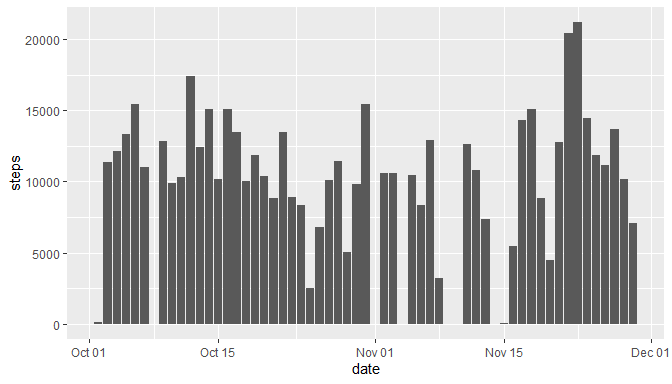
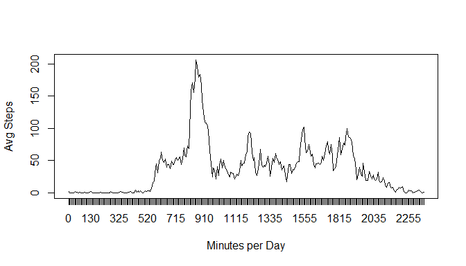
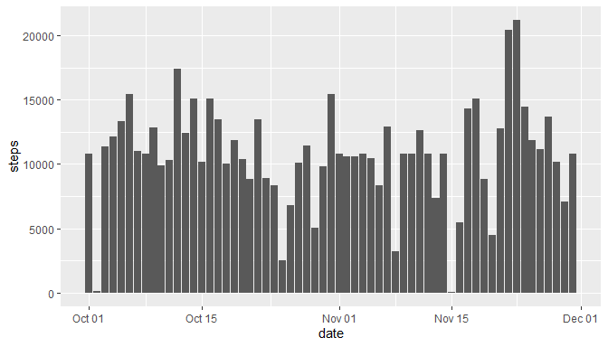
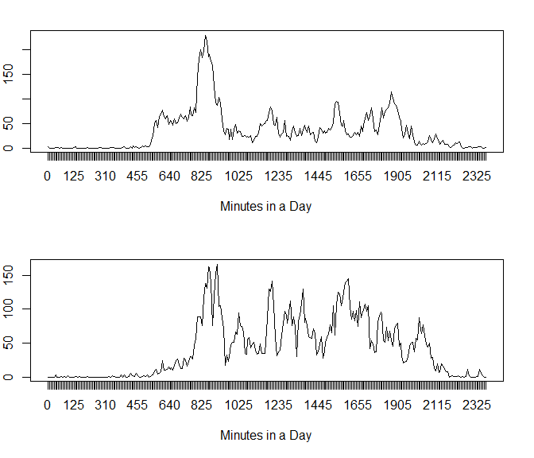

Project 1: Reproducible Research
================
Daniel
16 September 2021

# R Markdown for Peer Review

This an R markdown file generated for completion of the Reproducible
Research Course Project 1.

# What is mean total number of steps taken per day?

The following code loads the file to a csv in the working directory. It
then converts date column to date datatype and then converts data set to
a data frame.

``` r
activity <- read.csv("activity.csv")

activity$date <- as.Date(activity$date, "%Y-%m-%d")
activity <- as.data.frame(activity)
```

This Plots a histogram for the step total by day using ggplot2

    ## Warning: `fun.y` is deprecated. Use `fun` instead.

<!-- -->

This calculates mean and median number of steps taken by day.

``` r
steps <- with(activity, tapply(steps, date, sum, na.rm = TRUE))

mean(steps)
```

    ## [1] 9354.23

``` r
median(steps)
```

    ## [1] 10395

\#What is the average daily activity pattern?

When we use tapply, the mean for each interval is calculated across
days.

``` r
daymeans <- with(na.omit(activity), tapply(steps, interval, mean))
head(daymeans)
```

    ##         0         5        10        15        20        25 
    ## 1.7169811 0.3396226 0.1320755 0.1509434 0.0754717 2.0943396

<!-- -->

A logical vector is used to select the max value for the mean steps
across intervals. It appears the 835th interval gives the maximum value.

``` r
daymeans[which(daymeans == max(daymeans))]
```

    ##      835 
    ## 206.1698

The code below takes the summation of the ‘na’ values and reports the
ratio of na / total observations.

``` r
library(scales)
sum(is.na(activity))
```

    ## [1] 2304

``` r
percent(sum(is.na(activity))/nrow(activity))
```

    ## [1] "13%"

\#Inputing missing values

My idea for replacing NAs values is to substitute each NA value by the
steps mean per interval.This could be done by nesting a loop to identify
the interval of the respective row and then replacing the NA value with
the mean for that previously mentioned interval.

To test, we can check the head and the tail of the data both contain
NAs.

``` r
head(activity)
```

    ##   steps       date interval
    ## 1    NA 2012-10-01        0
    ## 2    NA 2012-10-01        5
    ## 3    NA 2012-10-01       10
    ## 4    NA 2012-10-01       15
    ## 5    NA 2012-10-01       20
    ## 6    NA 2012-10-01       25

``` r
tail(activity)
```

    ##       steps       date interval
    ## 17563    NA 2012-11-30     2330
    ## 17564    NA 2012-11-30     2335
    ## 17565    NA 2012-11-30     2340
    ## 17566    NA 2012-11-30     2345
    ## 17567    NA 2012-11-30     2350
    ## 17568    NA 2012-11-30     2355

The int and len variable are then set to manage the ‘for loop’ cases.
NAin and NA steps variables are the sections of data that will replace
the NA data after the loop.

``` r
int <- unique(activity$interval)
len <- nrow(activity[is.na(activity),])

NAint <-  activity[is.na(activity),3]
NAsteps <- activity[is.na(activity),1]

for (j in 1:2304) {
       for (i in 1:288){
              if (NAint[j] == int[i])
                     NAsteps[j] <- daymeans[i]
       
       }
}

NAindex <- is.na(activity$steps)
activity$steps<- replace(activity$steps,NAindex, NAsteps)
```

As shown below, the NA values were replaced by the appropriate mean for
the 5 min interval.

``` r
head(activity)
```

    ##       steps       date interval
    ## 1 1.7169811 2012-10-01        0
    ## 2 0.3396226 2012-10-01        5
    ## 3 0.1320755 2012-10-01       10
    ## 4 0.1509434 2012-10-01       15
    ## 5 0.0754717 2012-10-01       20
    ## 6 2.0943396 2012-10-01       25

``` r
tail(activity)
```

    ##           steps       date interval
    ## 17563 2.6037736 2012-11-30     2330
    ## 17564 4.6981132 2012-11-30     2335
    ## 17565 3.3018868 2012-11-30     2340
    ## 17566 0.6415094 2012-11-30     2345
    ## 17567 0.2264151 2012-11-30     2350
    ## 17568 1.0754717 2012-11-30     2355

A histogram is shown below with the updated data.

    ## Warning: `fun.y` is deprecated. Use `fun` instead.

<!-- -->

This Calculates the mean and median of steps taken by day

``` r
steps <- with(activity, tapply(steps, date, sum, na.rm = TRUE))

mean(steps)
```

    ## [1] 10766.19

``` r
median(steps)
```

    ## [1] 10766.19

Do these values differ from the estimates from the first part of the
assignment? What is the impact of inputing missing data on the estimates
of the total daily number of steps?

Yes they changed since the NAs were replaced with the interval mean. The
mean and the median for the day now appropriately match.

\#Are there differences in activity patterns between weekdays and
weekends?

The code below creates a new factor variable.

``` r
library(dplyr)
```

    ## 
    ## Attaching package: 'dplyr'

    ## The following objects are masked from 'package:stats':
    ## 
    ##     filter, lag

    ## The following objects are masked from 'package:base':
    ## 
    ##     intersect, setdiff, setequal, union

``` r
activity <- mutate(activity, day = weekdays(activity$date))

weekdays <- c('Monday', 'Tuesday', 'Wednesday', 'Thursday', 'Friday')

activity$day <- factor((weekdays(activity$date) %in% weekdays), 
         levels=c(FALSE, TRUE), labels=c('Weekend', 'Weekday'))
```

``` r
weekdays <- subset(activity, day == "Weekday")
weekends <- subset(activity, day == "Weekend")

weekendmeans <- with(weekends, tapply(steps, interval, mean))
weekdaymeans <- with(weekdays, tapply(steps, interval, mean))
```

<!-- -->
